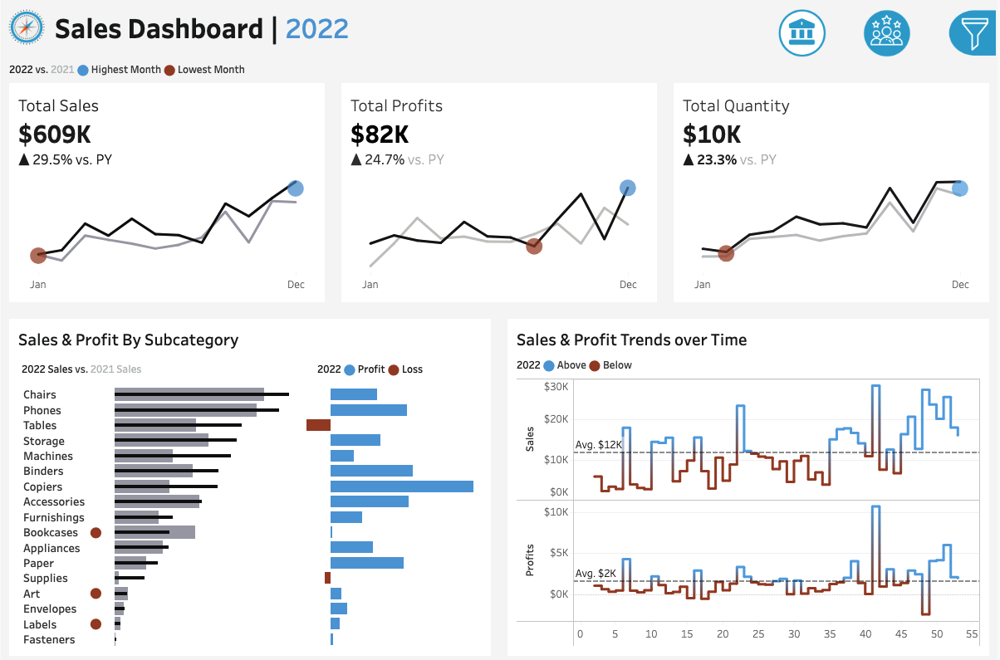

# 📊 Tableau Sales & Customer Performance Dashboard

This project features two interactive Tableau dashboards - **Sales Performance** and **Customer Analysis** - designed to help business stakeholders analyze sales trends, understand customer behavior, and make data-driven decisions.



## 🎯 Project Objectives & Business Value
This project enables organizations to:
- Track sales growth and profit fluctuations effectively.
- Identify high-performing products and customer segments.
- Improve customer satisfaction through data-driven marketing.
- React proactively to seasonal sales trends and anomalies.

## 📌 Dashboards Overview

### 1. 📈 Sales Performance Dashboard

**Purpose:**  
To analyze year-over-year sales performance, track key metrics, and identify trends in product and time-based sales performance.

#### ✅ Features
- **KPI Summary:**  
  - Total Sales, Profit, and Quantity for current and previous year.

- **Monthly Sales Trends:**  
  - Visualize monthly data for all KPIs (Sales, Profit, Quantity).
  - Highlight months with the highest and lowest sales.

- **Product Subcategory Comparison:**  
  - Compare performance across subcategories for current and previous years.
  - View sales alongside profit for each category.

- **Weekly Trends:**  
  - Weekly breakdown of Sales and Profit for the current year.
  - Highlight weeks above and below average to track performance patterns.

---

### 2. 👥 Customer Analysis Dashboard

**Purpose:**  
To understand customer behavior, trends, and segments to enhance marketing and retention strategies.

#### ✅ Features
- **Customer KPIs:**  
  - Total Customers, Sales per Customer, and Total Orders for the current and previous year.

- **Monthly Customer Trends:**  
  - Track KPIs by month.
  - Highlight months with the highest and lowest customer-related sales.

- **Customer Order Distribution:**  
  - Distribution of customers by number of orders to assess engagement and loyalty.

- **Top 10 Customers by Profit:**  
  - Ranks top 10 customers based on profit generated.
  - Displays number of orders, total sales/profit, and last order date.

## 🧩 Design & Interactivity

- **Year Selector:**  
  Users can dynamically view historical data for any selected year.

- **Interactive Charts:**  
  Clickable charts and graphs to filter and explore specific data segments.

- **Seamless Navigation:**  
  Users can switch between dashboards with ease.

- **Filters:**  
  Data can be filtered by:
  - **Product Info:** Category & Subcategory  
  - **Location Info:** Region, State, City

## 🎥 Dashboard Demo
> **🔗 View the Dashboard on [Tableau Public](https://public.tableau.com/views/SalesCustomerAnalysisDashboard_17447818756340/SalesDashboard)**


## 📁 File Structure

```
📁 Sales-Customer-Tableau-Dashboard/
├── media/
│   ├── sales-dashboard.png              # Screenshot of Sales Dashboard
│   └── sales-dashboard-demo.gif         # Demo of the interactive dashboards
├── sales-dashboard-materials/           # Supporting materials for Tableau dashboards
│   ├── Dashboard Icons/                 # Icons used in dashboard UI
│   ├── EU-Dataset/                      # Dataset for EU region
│   └── Non-EU Dataset/                  # Dataset for Non-EU region
├── sales_customer_dashboard.twb         # Tableau workbook file
└── README.md                            # Project documentation for Tableau dashboard
```

## 👩🏽‍💻 Contact
Glory Odeyemi - Data Engineer & Analyst
- For questions, feedback, opportunities, or collaborations, connect with me via [LinkedIn](https://www.linkedin.com/in/glory-odeyemi/).
- For more exciting projects or inspiration, check out my [GitHub repositories](https://github.com/gloryodeyemi).
